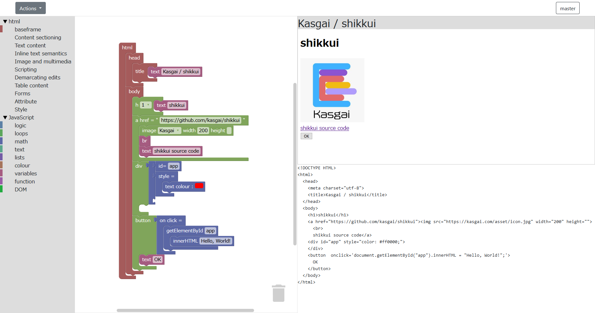

# shikkui

The visual programming editor for html and JavaScript.



## Usage

```sh
git clone https://github.com/Kasgai/shikkui.git
cd shikkui
git submodule update --init --recursive
```

## Library files

You can modify the blocks using the [Blockly Developer Tools](https://blockly-demo.appspot.com/static/demos/blockfactory/index.html)

## Licence

[GPL-3.0](https://github.com/Kasgai/shikkui/blob/firebase/LICENSE)

This Project is based on [blockly-html](https://github.com/bwinf/blockly-html).

## Authors

[Hagi](https://github.com/iPolyomino), [Yuji Sasaki](https://github.com/jyu0414)
